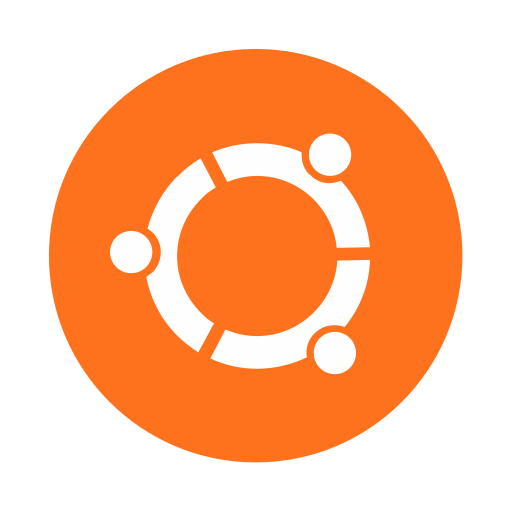

<!-- Debian -->

# Debian 

**Проект Debian** - это ассоциация людей, которые объединились для создания свободной операционной системы.
## About

- Based on: Independent
- Workspaces: AfterStep, Awesome, Blackbox, Cinnamon, Fluxbox, flwm, FVWM, GNOME, i3, IceWM, ion, JWM, KDE, LXDE, LXQt, MATE, Openbox, pekwm, Ratpoison, WMaker, XBMC, Xfce
- Category: Desktop, Live-Medium, Server

## TIP
Используют для сервера или работы. Довольно стойкие сервера которые работают годами без перезагрузки. Также фундамент для большинства систем.
## Sources
Home page: https://www.debian.org/

<!-- Ubuntu -->

# Ubuntu

 
**Ubuntu Linux** - это полноценная настольная операционная система Linux, свободно распространяемая и с наличием поддержки как со стороны сообщества, так и профессионалов. Сообщество Ubuntu построено на идеях, изложенных в Ubuntu Manifesto: программное обеспечение должно быть бесплатным, программные средства должны быть пригодными для использования людьми на их родном языке и должны пренебрегать любыми их физическими недостатками, люди должны быть свободны в настройке и изменении своего программного обеспечения любым удобным для них способом. "Ubuntu" - это древнее африканское слово, означающее "гуманность к остальным". Дистрибутив Linux Ubuntu приносит дух Ubuntu в мир программного обеспечения.

> [!IMPORTANT]
> - Based on: Debian (Stable)
> - Workspaces: GNOME, Unity, KDE, LXQt, Budgie, Cinnamon, UKUI, MATE, Studio, Xfce
> - Category: Beginners, Desktop,Server, Live-Medium

> [!TIP]
>Подходит для серверов и рабочих пк. Часто ставят на домашний пк. Пакеты приходит с задержкой и ядро не самое новое.
## Sources
Home page: https://ubuntu.com/

<!-- Linux Mint -->

# Linux Mint

**Linux Mint** - это дистрибутив на базе Ubuntu, целью которого является создание классического рабочего стола с множеством удобных пользовательских инструментов и дополнительной поддержкой мультимедиа из коробки. Кроме того, в дистрибутиве есть собственный рабочий стол и меню, несколько уникальных инструментов настройки и веб-интерфейс для установки пакетов. Linux Mint совместим с репозиториями программного обеспечения Ubuntu. Кроме версии, основанной на Ubuntu, проект также выпускает отдельную версию "Debian" (LMDE), основанную на последней стабильной версии Debian.

> [!IMPORTANT]
> - **Based on:** [#Base/Debian-Stable](), [#Base/Ubuntu-LTS]()
> - **Workspaces:** [#Cinnamon](), [#MATE](), [#Xfce]()
> - **Category:** [#Beginners](), [#Desktop](), [#Live-Medium]()

> [!TIP]
Подойдёт для новичков. Удобный дизайн, легко обновляются драйвера, ядро и система.
## Sources
Home page: https://www.linuxmint.com/

<!-- Manjaro Linux -->

# Manjaro Linux

**Manjaro Linux** - это быстрая, удобная, ориентированная на рабочий стол операционная система, основанная на Arch Linux. Среди ключевых особенностей - интуитивно понятный процесс установки, автоматическое определение оборудования, стабильная модель rolling-release, возможность установки нескольких ядер, специальные Bash-скрипты для управления графическими драйверами и широкие возможности настройки рабочего стола. Manjaro Linux предлагает Xfce в качестве основного рабочего стола.

> [!IMPORTANT]
> - **Based on:** Arch
> - **Workspaces:** Awesome, bspwm, Budgie, Cinnamon, GNOME, i3, KDE Plasma, LXQt, MATE, Openbox, Sway, Xfce
> - **Category:** Beginners, Desktop, Live-Medium

> [!TIP]
Подойдёт для новичков. Удобный дизайн, легко обновляются драйвера, ядро и система. 
## Sources
Home page: https://manjaro.org/

<!-- Fedora -->

# Fedora

**Fedora Linux** - дистрибутив разработанный поддерживаемым сообществом проектом Fedora Project и принадлежащий компании Red Hat. Fedora Linux содержит программное обеспечение, распространяемое под свободной лицензией с открытым исходным кодом, и стремится быть на переднем крае таких технологий. Fedora известна тем, что уделяет большое внимание инновациям, интегрирует новые технологии на ранних этапах и тесно сотрудничает с сообществами разработчиков Linux. Рабочим столом по умолчанию в Fedora Linux является среда рабочего стола GNOME, а интерфейсом по умолчанию - GNOME Shell. Доступны и другие окружения рабочего стола, включая KDE, Xfce, LXDE, MATE и Cinnamon. Проект Fedora также распространяет пользовательские версии Fedora, называемые Fedora spins. Они построены на основе определенных наборов программ, предлагают альтернативные окружения рабочего стола или ориентированы на конкретные интересы, такие как игры, безопасность, дизайн, научные вычисления и робототехника.

> [!IMPORTANT]
> - **Based on:** Independent
> - **Workspaces:** Awesome, Budgie, Cinnamon, Enlightenment, i3, GNOME, KDE Plasma, LXDE, LXQt, MATE, Openbox, Pantheon, Ratpoison, Xfce
> - **Category:** Desktop, Immutable, Server, Live Medium

## Sources
Home page: https://getfedora.org/

<!-- Arch -->

# Arch Linux

**Arch Linux** - это независимо разработанный, оптимизированный под x86_64 дистрибутив Linux, ориентированный на компетентных пользователей Linux. Он использует "pacman", свой собственный менеджер пакетов, для обеспечения обновлений новейших программных приложений с полным отслеживанием зависимостей. Работающий по системе скользящего выпуска, Arch может быть установлен с образа CD или через FTP-сервер. Установка по умолчанию обеспечивает надежную основу, которая позволяет пользователям создавать собственные установки. Кроме того, система сборки Arch Build System (ABS) позволяет легко собирать новые пакеты, изменять конфигурацию имеющихся пакетов и делиться этими пакетами с другими пользователями через пользовательский репозиторий Arch Linux.

> [!IMPORTANT]
> - **Based on:** Independent
> - **Workspaces:** Cinnamon, Enlightenment, GNOME, KDE, LXDE, MATE, Xfce
> - **Category:** Desktop, Server

## Sources
Home page: http://www.archlinux.org/

